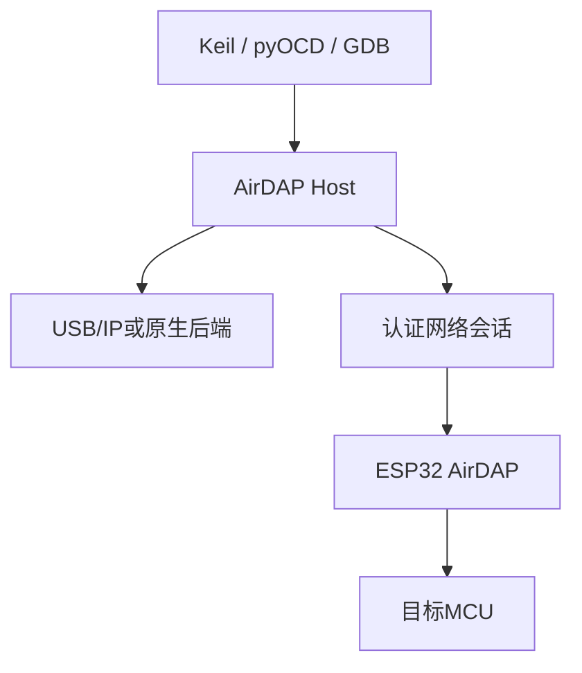

# AirDAP 完整路线图

> 目标平台：ESP32-S3、Windows 10/11、Linux
> 核心功能：USB/Wi-Fi CMSIS-DAP、目标串口、BLE配网、自动发现、USB/IP映射、目标供电/复位、OTA

## 0. 文档状态与当前进度

更新时间：2026-08-29

本文档是 AirDAP 当前唯一的项目路线图，统一记录产品目标、已经确认的技术决策、实施顺序、阶段出口和第一版验收标准。

当前目标是 **CMSIS-DAP v2 Bulk + CDC ACM** 复合设备，不包含 DAPLink 的 U 盘拖拽烧录功能。

| 工作项 | 状态 | 当前结果 |
|---|---|---|
| 产品目标与总体架构 | 已规划 | 本文档已覆盖设备端、主机端、Windows、Linux、安全和产品化路线 |
| 电路工程 | 进行中 | KiCad 工程位于 `circuit/`；软件阶段未对硬件进行审查 |
| 阶段0：Windows USB/IP关键风险验证 | 有条件通过 | 当前 Windows 11 环境已完成 WinUSB 和 CDC ACM 真实枚举及数据验证；Secure Boot 开启场景待验证 |
| 阶段1：有线固件 | 进行中 | bootloader hook、GPIO/ADC/复位、SWD、CMSIS-DAP v2 Bulk 和 CDC-UART 软件已实现并通过构建/9 套主机测试；已有 bootloader 产物门禁和自动化 HIL 工具，USB 枚举、目标烧录及电气行为待实板验收 |
| 阶段2：无线设备端 | 未开始 | 尚未实现配网、发现、认证、DAP TCP 和 UART TCP |
| 阶段3：跨平台主机核心 | 未开始 | 尚未建立正式主机工程 |
| 阶段4：Windows集成 | 未开始 | 尚未实现正式服务、自动映射和安装程序 |
| 阶段5：Linux支持 | 未开始 | 尚未实现 systemd、Linux USB/IP 和 pyOCD 插件 |
| 阶段6：产品化 | 未开始 | 尚未实现安全启动、签名 OTA、GUI 和发布流程 |

### 阶段0验证记录

一次性 USB/IP 模拟器已经证明以下链路在当前 Windows 11 测试环境中可行：

- 使用 `usbip-win2 0.9.7.7 x64`；
- 两个内核驱动的数字签名均有效，签发者为 Microsoft Windows Hardware Compatibility Publisher；
- Windows 未启用 `TESTSIGNING`；
- USB/IP 设备成功挂载为 `usbccgp` 复合设备；
- CMSIS-DAP 接口成功绑定 `WINUSB`，Bulk OUT/IN 端点为 `0x01/0x81`；
- 通过 WinUSB 实际完成 `DAP_Info` 交互，返回包长 64 和固定序列号；
- CDC ACM 接口成功绑定 `usbser` 并生成虚拟 COM 口；
- 通过真实 COM 口完成串口回环；
- 删除模拟器前，描述符、协议和 TCP 边界测试共 18 项全部通过。

结论：本机 USB/IP 服务模拟 **CMSIS-DAP v2 Bulk + CDC ACM** 的方案可以进入正式实现阶段。

当前测试电脑的 Secure Boot 处于关闭状态。阶段4完成前，必须在一台开启 Secure Boot 的 Windows 10/11 电脑上重新验证驱动加载、USB/IP 挂载以及 WinUSB/CDC 枚举。

阶段0使用的 Python 模拟器、自动化测试和 Windows 冒烟测试脚本已经删除。删除仓库文件不会卸载 Windows 中已经安装的 `usbip-win2` 驱动。

### 路线图执行规则

1. 按阶段0至阶段6的依赖顺序推进；只有达到当前阶段出口，下一阶段才能作为主线工作开始。
2. 每项完成状态必须由本阶段列出的可观察结果证明，不能仅以代码已经编写作为完成依据。
3. 发现会改变协议、驱动选择、信任边界或发布方式的新约束时，先更新本文档中的技术决策和受影响阶段，再实施代码。
4. 硬件引脚、电源和复位行为以通过审查的 KiCad 工程及后续板级验证结果为准；软件不得仅依据本路线图中的草图假定硬件已经定版。

## 1. 项目目标

AirDAP是一款同时支持有线和无线工作的CMSIS-DAP调试器。

预期使用体验：

1. 长按AirDAP按键进入BLE配网。
2. 电脑端程序通过BLE写入Wi-Fi配置。
3. 电脑保存AirDAP永久设备号和认证密钥。
4. AirDAP以后上电自动连接Wi-Fi。
5. 电脑端服务自动发现并认证设备。
6. Windows通过已签名的USB/IP驱动显示为CMSIS-DAP。
7. Linux通过内核USB/IP或pyOCD原生插件使用。
8. 用户不需要重复输入IP或手工映射。

需要映射的是CMSIS-DAP接口，而不是完整DAPLink。第一版不实现DAPLink的U盘拖拽烧录功能。

## 2. 主要技术决策

| 项目 | 方案 |
|---|---|
| ESP32框架 | ESP-IDF稳定版本 |
| 有线DAP | TinyUSB CMSIS-DAP v2 Bulk |
| 有线串口 | TinyUSB CDC ACM |
| 无线DAP | CMSIS-DAP命令包通过认证TCP传输 |
| 无线串口 | 独立UART TCP/TLS通道 |
| 配网 | ESP-IDF BLE Provisioning |
| 自动发现 | mDNS为主，UDP心跳为补充 |
| Windows虚拟DAP | 本机USB/IP服务＋已签名usbip-win VHCI |
| Linux虚拟DAP | Linux内核USB/IP或pyOCD插件 |
| 无线虚拟USB | CMSIS-DAP v2 Bulk＋CDC ACM复合设备 |
| 调试接口 | 第一版优先SWD＋UART，后续扩展JTAG |
| 并发 | 一个目标同一时刻只有一个DAP所有者 |
| OTA | 双分区、签名、失败自动回滚 |

## 3. 总体架构



### 有线模式

```text
Keil/pyOCD
    ↕ USB CMSIS-DAP v2
ESP32 DAP协议层
    ↕ SWD/JTAG后端
目标MCU
```

目标串口：

```text
电脑虚拟COM
    ↕ USB CDC ACM
ESP32 UART
    ↕ GPIO17/GPIO18
目标MCU
```

### Windows无线模式

```text
Keil/pyOCD/串口工具
    ↕ 虚拟CMSIS-DAP v2 Bulk＋CDC ACM
已签名usbip-win VHCI
    ↕ 本机USB/IP：127.0.0.1:3240
AirDAP Service
    ↕ 认证DAP TCP
ESP32 AirDAP
    ↕ SWD
目标MCU
```

### Linux无线模式

兼容模式：

```text
IDE/串口工具
  ↕ CMSIS-DAP v2 Bulk＋CDC ACM
Linux vhci_hcd
  ↕ 本机USB/IP
airdapd
  ↕ 网络
ESP32
```

推荐原生模式：

```text
GDB/IDE
  ↕
pyOCD AirDAP插件
  ↕ 认证DAP TCP
ESP32
```

## 4. 工作模式

### 4.1 有线模式

USB存在并枚举成功时：

- 启用CMSIS-DAP v2；
- 启用CDC目标串口；
- USB默认拥有DAP优先权；
- Wi-Fi可以继续用于状态、配置和OTA；
- 网络DAP请求返回设备忙。

### 4.2 无线模式

USB不存在时：

- 自动连接保存的Wi-Fi；
- 发布mDNS和UDP上线信息；
- 启动DAP及UART网络服务；
- 监测VTref；
- 禁止从AirDAP向目标反向供电；
- 允许电脑端服务取得DAP所有权。

### 4.3 所有权

```c
typedef enum {
    DAP_OWNER_NONE,
    DAP_OWNER_USB,
    DAP_OWNER_NETWORK
} dap_owner_t;
```

规则：

1. 第一个成功执行`DAP_Connect`的客户端取得所有权。
2. 其他客户端返回`BUSY`。
3. `DAP_Disconnect`、USB拔出、TCP断开或会话超时释放所有权。
4. 所有权切换后重新执行SWD Line Reset。

## 5. ESP32固件

### 5.1 启动流程

1. 设置SWD、复位、供电GPIO为安全状态。
2. 初始化电源状态、ADC、UART和SPI。
3. 读取NVS配置。
4. 检测USB和VTref。
5. 启动USB DAP/CDC或Wi-Fi。
6. 启动管理、发现和OTA服务。

安全状态：

| 信号 | 启动状态 |
|---|---|
| SWCLK | 低 |
| SWDIO | 高阻 |
| SWDIO DIR | 低，目标到ESP32 |
| nRESET控制 | 低，释放目标复位 |
| 目标供电控制 | 开漏释放 |
| UART TX | 空闲高 |

### 5.2 引导程序

- ESP32-S3 一级引导程序固化在 Mask ROM 中，不属于本仓库。
- 二级引导使用 ESP-IDF 标准 bootloader，不自行实现分区选择和镜像加载。
- AirDAP 通过 `bootloader_before_init()` hook 在应用镜像校验前设置上表的目标侧 GPIO 安全状态。
- 从复位释放到 hook 执行之前由 Mask ROM 控制，这段窗口的电平安全依赖芯片默认状态和板上上下拉，必须通过原理图审查和实板测量确认。
- 开发阶段保留 ESP-IDF 的启动看门狗、内存区域保护和应用镜像校验。
- Secure Boot、Flash Encryption、OTA 双分区和失败回滚按后续阶段启用；确定 ESP32-S3-MINI-1U 具体料号和 Flash 容量前不固化 OTA 分区布局。

### 5.3 按键和BLE配网

| 操作 | 功能 |
|---|---|
| 短按 | 显示状态或保留 |
| 长按3秒 | 启动BLE配网120秒 |
| 长按10秒 | 清除Wi-Fi和配对信息 |
| 按住同时上电 | 进入ESP32 ROM下载模式 |

GPIO0的启动采样无法被固件屏蔽。恢复设置后应等待按键释放再重启。

BLE配网建议使用：

- `wifi_provisioning`
- `protocomm_ble`
- Security 2/SRP6a
- 每设备独立Proof of Possession
- 配网完成后关闭BLE并释放内存

### 5.4 设备身份

```text
设备号：ADP-A1B2C3D4
UUID：SHA256(产品命名空间＋eFuse MAC)前128位
```

设备号只用于识别，不能作为认证密码。电脑应保存：

- 设备UUID；
- 设备友好名称；
- 认证密钥；
- 上次IP；
- 固件及协议版本；
- 固定USB序列号。

### 5.5 自动发现

mDNS：

```text
服务：_airdap._tcp.local
主机：airdap-a1b2c3.local
```

TXT记录：

```text
id=ADP-A1B2C3D4
proto=1
fw=1.0.0
cap=swd,uart,power,ota
state=idle
dap_port=3260
uart_port=3261
```

mDNS只能用于发现，连接后必须重新认证。

回退方式：

1. UDP组播心跳；
2. 尝试上次IP；
3. 手动输入IP；
4. 可配置静态IP。

### 5.6 网络端口

| 端口 | 功能 |
|---:|---|
| TCP 3260 | DAP及控制协议 |
| TCP 3261 | 目标UART |
| TCP 3240 | 仅电脑本机USB/IP使用 |
| HTTPS | 配置和OTA，可选 |

ESP32不监听USB/IP标准端口3240。

### 5.7 AirDAP帧协议

```c
typedef struct __attribute__((packed)) {
    uint32_t magic;          // "ADAP"
    uint8_t  version;
    uint8_t  type;
    uint16_t flags;
    uint32_t session_id;
    uint32_t sequence;
    uint16_t payload_length;
    uint16_t reserved;
} airdap_frame_header_t;
```

消息类型：

- `HELLO`
- `AUTH`
- `DAP_REQUEST`
- `DAP_RESPONSE`
- `CONTROL_REQUEST`
- `CONTROL_RESPONSE`
- `KEEPALIVE`
- `ERROR`

需要检查：

- 协议版本；
- 帧长度上限；
- 会话ID；
- 请求序号；
- 客户端权限；
- DAP所有权；
- 超时和旧响应。

内部DAP缓冲固定为512字节。ESP32-S3 的全速 USB CMSIS-DAP v2 接口对主机
声明508字节包上限，使最大响应不落在64字节端点整数边界，避免 TinyUSB
Vendor 流自动追加的 ZLP 被主机当作下一条响应；Windows虚拟HID第一版只
使用64字节。

### 5.8 安全

推荐TLS-PSK或TLS设备证书。

要求：

- 每台AirDAP独立密钥；
- 未配对设备不自动连接；
- DAP、UART、供电和OTA都需要认证；
- mDNS数据不能作为身份凭据；
- OTA固件必须签名；
- 产品阶段启用Secure Boot和Flash Encryption；
- 第一版不直接暴露到公网。

### 5.9 CMSIS-DAP

至少实现：

- `DAP_Info`
- `DAP_HostStatus`
- `DAP_Connect`
- `DAP_Disconnect`
- `DAP_TransferConfigure`
- `DAP_Transfer`
- `DAP_TransferBlock`
- `DAP_WriteABORT`
- `DAP_Delay`
- `DAP_ResetTarget`
- `DAP_SWJ_Pins`
- `DAP_SWJ_Clock`
- `DAP_SWJ_Sequence`
- `DAP_SWD_Configure`
- `DAP_SWD_Sequence`

第一版不支持SWO、Trace和Mass Storage。

### 5.10 SWD后端

```text
SPI：SPI2
SCLK：GPIO12
3-wire数据：GPIO13
DIR：GPIO14
模式：Mode 0
位序：LSB first
方式：Half duplex
CS：无
Dummy：0
```

时钟：

| 阶段 | SWCLK |
|---|---:|
| 调通 | 500kHz～1MHz |
| 默认 | 5MHz |
| 优化 | 10MHz |

底层必须处理：

- Request编码；
- Turnaround；
- OK/WAIT/FAULT；
- 数据奇偶校验；
- WAIT重试；
- DP ABORT；
- AP Posted Read；
- DP RDBUFF；
- Idle Cycle；
- 目标掉电和方向安全切换。

连接顺序：

1. SWDIO高；
2. 至少56个高电平周期；
3. 发送`0xE79E`，LSB first；
4. 再发送至少50个高电平周期；
5. Idle；
6. 读取DP IDCODE；
7. 清错并初始化DP/AP。

第一版使用`spi_device_polling_transmit()`和内部RAM静态缓冲。性能不足时只替换`swd_engine`内部为HAL/LL实现。

### 5.11 UART

```text
GPIO17：AirDAP TX → 目标RX
GPIO18：AirDAP RX ← 目标TX
```

要求：

- USB模式使用CDC；
- 无线模式使用UART TCP；
- 支持动态波特率；
- 使用环形缓冲；
- RX可以镜像给多个只读客户端；
- TX只能有一个所有者；
- JTAG模式下禁用UART。

### 5.12 目标供电和复位

GPIO9必须配置为开漏：

```c
GPIO_MODE_INPUT_OUTPUT_OD
```

| 操作 | GPIO9 |
|---|---|
| 允许目标供电 | 写1，释放高阻 |
| 禁止目标供电 | 写0，主动拉低 |
| 读取TPS2116状态 | 释放后读取 |

禁止推挽输出高。

上电流程：

1. 确认USB存在；
2. 确认TPS2116选择USB；
3. 读取VTref；
4. 目标已自供电时不主动输出；
5. 释放GPIO9；
6. 等待VTref稳定；
7. 释放nRESET；
8. 建立SWD。

断电流程：

1. 停止DAP；
2. SWCLK拉低；
3. SWDIO高阻；
4. GPIO9拉低；
5. 监测VTref下降；
6. 未下降则报告目标仍由外部供电。

### 5.13 FreeRTOS任务

| 任务 | 核心 | 职责 |
|---|---:|---|
| `dap_worker` | Core 1 | 执行SWD/JTAG |
| `usb_transport` | Core 1 | USB DAP |
| `network_dap` | Core 0 | 网络DAP |
| `target_uart` | Core 1 | UART桥 |
| `network_manager` | Core 0 | Wi-Fi、mDNS、重连 |
| `power_monitor` | Core 0 | 电源和VTref |
| `ble_provision` | Core 0 | BLE配网 |
| `ota_manager` | Core 0 | OTA |
| `web_manager` | Core 0 | 可选管理页面 |

所有DAP请求进入一个队列，由`dap_worker`顺序执行。

## 6. 主机软件

推荐使用Rust实现跨平台核心，分为：

- `airdap-core`：协议、认证、设备注册和会话；
- `airdap-usbip`：USB/IP设备模拟；
- `airdap-platform`：Windows/Linux适配；
- `airdap-daemon`：系统服务；
- `airdap-cli`：命令行；
- `airdap-ui`：BLE配网和管理界面。

GUI可使用Tauri，第一版也可以使用CLI＋本地Web UI。

### 6.1 Daemon职责

- 开机自动启动；
- mDNS/UDP发现；
- 保存配对设备；
- 建立认证TCP连接；
- 管理在线和离线；
- 启动本机USB/IP服务；
- 自动Attach/Detach；
- 向GUI和CLI提供本地IPC；
- 收集日志和性能数据。

### 6.2 本地IPC

| 系统 | IPC |
|---|---|
| Windows | Named Pipe |
| Linux | Unix Domain Socket |

GUI不直接连接ESP32，所有操作通过Daemon完成。

### 6.3 CLI

```text
airdapctl list
airdapctl pair
airdapctl info <id>
airdapctl power <id> on|off|cycle
airdapctl reset <id>
airdapctl uart <id>
airdapctl update <id> firmware.bin
airdapctl logs <id>
```

## 7. Windows USB/IP

使用未修改、已通过微软签名且支持Windows导入的usbip-win/VHCI驱动。

要求：

- 固定经过验证的具体版本；
- `.sys`、`.inf`和`.cat`原样安装；
- 不修改或重新编译驱动；
- 验证许可证允许重新分发；
- Secure Boot开启；
- Test Signing关闭。

### 7.1 本地USB/IP服务

只监听：

```text
127.0.0.1:3240
```

禁止监听`0.0.0.0`，USB/IP不直接暴露到局域网。

每个AirDAP对应稳定的虚拟设备：

| 字段 | 示例 |
|---|---|
| Device ID | `ADP-A1B2C3D4` |
| Bus ID | `1-1` |
| Manufacturer | `AirDAP` |
| Product | `CMSIS-DAP AirDAP` |
| USB Serial | `ADP-A1B2C3D4` |

### 7.2 虚拟CMSIS-DAP

第一版固定模拟一个复合设备：

```text
Device Class：0xEF / 0x02 / 0x01（复合设备）
Interface 0：CMSIS-DAP v2，Vendor Class，WinUSB
DAP OUT/IN：Bulk 0x01 / 0x81
Interface 1/2：CDC ACM，Windows usbser
CDC Notify/OUT/IN：Interrupt 0x82 / Bulk 0x03 / Bulk 0x83
WinUSB绑定：Microsoft OS 2.0描述符
```

USB/IP服务至少支持：

- `OP_REQ_DEVLIST`
- `OP_REQ_IMPORT`
- `USBIP_CMD_SUBMIT`
- `USBIP_RET_SUBMIT`
- `USBIP_CMD_UNLINK`
- `USBIP_RET_UNLINK`
- 标准USB描述符
- BOS和Microsoft OS 2.0描述符
- `SET_CONFIGURATION`
- Control、Bulk和CDC Interrupt端点
- 请求取消和断线

第一版只模拟固定CMSIS-DAP v2＋CDC ACM复合设备，不实现通用USB设备框架。

### 7.3 自动映射

推荐虚拟USB实例长期存在：

- Daemon启动时启动本机USB/IP；
- 检查并自动Attach；
- AirDAP离线时虚拟设备仍保留；
- `DAP_Connect`返回后端离线；
- AirDAP上线后恢复后端；
- USB序列号始终不变；
- 避免Keil频繁重新选择设备。

## 8. Linux支持

Linux复用相同的：

- 协议；
- 设备发现；
- 认证；
- 配对数据库；
- USB/IP服务器；
- CLI；
- Daemon状态机。

### 8.1 USB/IP模式

```text
vhci_hcd
usbip-core
usbip用户工具
```

Daemon执行：

```bash
usbip attach -r 127.0.0.1 -b <busid>
```

并通过udev规则允许普通用户访问CMSIS-DAP。

### 8.2 原生pyOCD模式

Linux推荐优先使用原生插件：

```text
pyOCD
  ↕ AirDAP DebugProbe
airdap-core
  ↕ 网络
ESP32
```

优点：

- 不需要USB/IP；
- 支持更大DAP包；
- 更适合流水线和批量访问；
- 错误信息更明确；
- 更适合自动烧录和CI。

## 9. 项目目录

```text
airdap/
├── ROADMAP.md
├── LICENSE
├── CHANGELOG.md
├── docs/
│   ├── architecture.md
│   ├── protocol.md
│   ├── cmsis-dap.md
│   ├── usbip.md
│   ├── security.md
│   ├── provisioning.md
│   ├── windows-install.md
│   ├── linux-install.md
│   ├── hardware-pinmap.md
│   └── test-plan.md
├── protocol/
│   ├── schema/
│   │   ├── airdap_protocol.yaml
│   │   └── error_codes.yaml
│   ├── vectors/
│   │   ├── discovery.json
│   │   ├── auth.json
│   │   └── dap_frames.bin
│   └── README.md
├── firmware/
│   ├── CMakeLists.txt
│   ├── sdkconfig.defaults
│   ├── partitions.csv
│   ├── main/
│   │   ├── app_main.c
│   │   └── app_state.c
│   ├── components/
│   │   ├── board/
│   │   ├── dap_core/
│   │   ├── dap_transport_usb/
│   │   ├── dap_transport_network/
│   │   ├── swd_engine/
│   │   ├── jtag_engine/
│   │   ├── target_uart/
│   │   ├── target_power/
│   │   ├── ble_provision/
│   │   ├── wifi_manager/
│   │   ├── discovery/
│   │   ├── airdap_protocol/
│   │   ├── device_identity/
│   │   ├── config_store/
│   │   ├── ota_manager/
│   │   └── diagnostics/
│   └── test/
│       ├── unit/
│       ├── hil/
│       └── fixtures/
├── host/
│   ├── Cargo.toml
│   ├── crates/
│   │   ├── airdap-core/
│   │   ├── airdap-usbip/
│   │   │   ├── src/server/
│   │   │   ├── src/device/
│   │   │   ├── src/hid/
│   │   │   └── src/urb/
│   │   ├── airdap-platform/
│   │   │   ├── src/windows/
│   │   │   └── src/linux/
│   │   ├── airdap-daemon/
│   │   ├── airdap-cli/
│   │   ├── airdap-ipc/
│   │   ├── airdap-pyocd/
│   │   └── airdap-simulator/
│   └── tests/
├── ui/
│   ├── src/
│   ├── src-tauri/
│   └── assets/
├── packaging/
│   ├── windows/
│   │   ├── installer/
│   │   ├── service/
│   │   ├── firewall/
│   │   └── usbip-dependency/
│   └── linux/
│       ├── systemd/
│       ├── udev/
│       ├── debian/
│       └── rpm/
├── simulator/
│   ├── fake-airdap/
│   ├── fake-target/
│   └── usbip-hid-demo/
├── tools/
│   ├── protocol-generator/
│   ├── firmware-signing/
│   ├── diagnostics/
│   └── release/
└── .github/
    └── workflows/
        ├── firmware.yml
        ├── host-windows.yml
        ├── host-linux.yml
        ├── integration.yml
        └── release.yml
```

## 10. 开发阶段

### 阶段0：USB/IP关键风险验证

状态：**有条件通过**。

- [x] 锁定 `usbip-win2 0.9.7.7 x64`；
- [x] 验证驱动签名、非 `TESTSIGNING` 运行和许可证；
- [x] 实现最小 USB/IP CMSIS-DAP v2＋CDC ACM 模拟器；
- [x] 验证 Windows 自动绑定 WinUSB 和 usbser；
- [x] 通过真实 WinUSB 完成 `DAP_Info`，并通过真实 COM 完成 CDC 回环；
- [ ] 在开启 Secure Boot 的 Windows 10/11 电脑上重复驱动加载、挂载、枚举和数据验证。

阶段出口：以上项目全部通过，并记录最终采用的驱动版本、安装方式和再分发要求。一次性模拟器已在当前验证结束后删除，正式实现不得直接依赖已删除的 PoC 文件。

### 阶段1：有线固件

状态：**进行中**。

- ESP-IDF 二级引导和目标侧 GPIO 安全 hook（软件已实现；产物门禁验证强符号、调用顺序、WDT、区域保护和完整镜像校验，待板级电平测量）；
- GPIO、电源、ADC和复位（驱动已实现，待实板测量）；
- SWD读取DP IDCODE（协议与 SPI2 后端已实现，待参考目标验证）；
- DP/AP访问（已实现 WAIT/FAULT、奇偶校验、AP Posted Read、RDBUFF 和 ABORT，待参考目标验证）；
- USB CMSIS-DAP v2（Bulk 描述符、Microsoft OS 2.0/WinUSB 和命令处理已实现，待真机枚举与工具验证）；
- USB CDC串口（CDC ACM 与 UART1 桥接及动态串口参数已实现，待双向实测）；
- 有线 HIL 自动化工具（已覆盖 USB 描述符、DAP_Info、508 字节边界、IDCODE、CDC 回环及 pyOCD 烧录回读；待实板执行并归档 JSON 证据）。

阶段出口：目标板通过 USB 同时枚举 CMSIS-DAP v2 和 CDC ACM；能够稳定读取 DP IDCODE、烧录并校验一个参考目标程序；串口双向传输和复位控制通过板级测试。

### 阶段2：无线设备端

状态：**未开始**。

- BLE配网；
- Wi-Fi连接；
- mDNS/UDP发现；
- 认证协议；
- DAP TCP；
- UART TCP；
- OTA。

阶段出口：设备完成首次配网后可以自动重连 Wi-Fi；主机能够发现并认证设备；DAP、UART 和 OTA 在断线、超时及错误认证情况下均返回明确结果且不会遗留所有权。

### 阶段3：跨平台主机核心

状态：**未开始**。

- Rust workspace；
- 设备注册表；
- 发现、认证和重连；
- CLI；
- 模拟器；
- 本地IPC。

阶段出口：Windows 和 Linux 使用同一核心库完成发现、认证、重连、DAP 和 UART 会话；CLI 能列出设备、显示状态并执行连接诊断；协议测试可在无硬件环境运行。

### 阶段4：Windows集成

状态：**未开始**。

- 本机USB/IP服务器；
- CMSIS-DAP v2 Bulk＋CDC ACM；
- 自动Attach；
- Windows Service；
- 安装包；
- Keil烧录和调试；
- 睡眠、重启和断线恢复。

阶段出口：在开启 Secure Boot 的 Windows 10/11 上，签名驱动和服务可由安装程序一次完成安装；设备上线后自动出现固定序列号的 WinUSB CMSIS-DAP 和虚拟 COM；Keil 完成擦除、下载、校验、断点和单步；睡眠、重启及网络恢复无需人工重新映射。

### 阶段5：Linux支持

状态：**未开始**。

- systemd和udev；
- Linux USB/IP；
- pyOCD插件；
- `.deb`包；
- Linux BLE配网。

阶段出口：受支持的 Linux 发行版可以通过安装包部署；systemd 服务自动启动；至少一种 USB/IP 兼容模式和 pyOCD 原生模式完成烧录、调试及断线恢复验证。

### 阶段6：产品化

状态：**未开始**。

- Secure Boot；
- Flash Encryption；
- 签名OTA；
- GUI；
- 多设备管理；
- 自动升级；
- JTAG；
- 性能和兼容性测试。

阶段出口：设备启用 ESP32 Secure Boot、Flash Encryption 和签名 OTA；升级失败可自动回滚；Windows/Linux 发布包可重复构建；兼容性、性能、恢复和多设备测试达到发布门槛。

## 11. 第一版验收标准

- 长按GPIO0进入BLE配网；
- 电脑保存设备号和密钥；
- AirDAP以后上电自动连接Wi-Fi；
- DHCP地址变化后仍能自动发现；
- Windows自动激活固定序列号CMSIS-DAP；
- Keil能连接、擦除、下载、校验、断点和单步；
- SWD默认稳定运行5MHz；
- USB提供CMSIS-DAP v2和CDC；
- 无线提供DAP和UART；
- USB与网络不会同时控制目标；
- 软件可以控制目标供电、复位和读取VTref；
- 掉线不会导致Keil或服务永久卡死；
- 设备恢复上线后自动重连；
- OTA失败能够回滚；
- Windows和Linux共享协议及主机核心。

## 12. 第一版不实现

- DAPLink Mass Storage；
- SWO和高速Trace；
- 公网调试；
- 多电脑抢占；
- 通用任意USB设备模拟；
- JTAG与目标UART同时工作；
- macOS虚拟USB。
